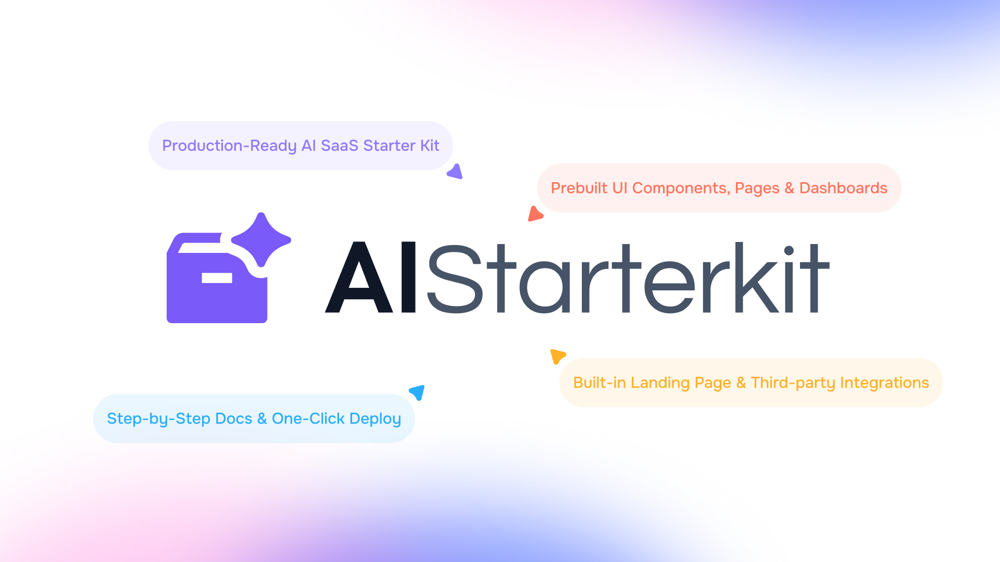

# AI SaaS Starter Template Kit for Next.js and Tailwind CSS

This is free and open source version of **AIStarterKit.dev** - A full-stack starter template kit for building AI-driven SaaS applications, crafted using **Next.js** and **Tailwind CSS**.



**AIStarterKit** includes ready-to-use core functionalities and integrations such as authentication, Stripe payment integration, database management, dashboards, and seamless AI API integration system. Allows you effortlessly build and launch AI-powered SaaS solutions for customers. Comes with examples - like generators for text, images, code, videos, and emails.


### Quick Links

- [✨ Visit Website](https://aistarterkit.dev)
- [📄 Documentation](https://aistarterkit.dev/docs)
- [🚀 View Demo](https://demo.aistarterkit.dev)
- [⚡ Get PRO Version](https://aistarterkit.dev/pricing)

If you are looking for AI SaaS Starter Kit, that can save you hundreds of hours and allow you to launch 100x faster, **AIStarterKit** is perfect choice for you

## Key Features

- **Next.js & Tailwind CSS:** Modern tech stack for fast, responsive, and scalable development with clean UI powered by Tailwind v4 and Next.js performance.
- **AI Integration:** Plug-and-play access to GPT, Midjourney, and other APIs to build AI features like text, code, and image generation instantly.
- **All Essential Integrations:** Come with all essential integrations like Stripe, NextAuth, and Drizzle ORM —skip setup and start shipping core AI SaaS features.
- **Pre-built SaaS Pages:** Includes dashboard, auth, pricing, error, and blog pages—launch-ready and designed to save weeks of development time.
- **Highly Customizable:** Modular code structure makes it easy to tweak layouts, replace logic, or add new features based on your product needs.
- **One-click Deployment on Vercel and Others:** Deploy on Vercel, netlify and other PaaS with one-click. Simply add environment variables and hit deploy button.
- **Lifetime Free Updates:** One-time purchase gives you ongoing updates—new features, improvements, and fixes without extra fees or monthly costs.

| ✨ Features                         | 🎁 AIStarterKit Free                 | 🔥 AIStarterKit Pro                        |
|----------------------------------|--------------------------------|--------------------------------------|
| Next.js Pages                    | Static                         | Dynamic Boilerplate Template         |
| Components                       | Limited                        | All According to Demo                |
| AI Functionality                 | Demo Only                      | Included                             |
| AI App Examples                  | 1 Example                      | All Examples (Same as Demo)          |
| Integrations (DB, Auth, etc.)    | Not Included                   | Included                             |
| Community Support                | Included                       | Included                             |
| Premium Email Support            | Not Included                   | Included                             |
| Lifetime Free Updates            | Included                       | Included
  
## Getting Started

We are using npm as our package manager.

> To use Yarn or any other package manager, delete the `package-lock.json` file and run the below commands using the package manager of your choice.

1. Install dependencies

   ```bash
   npm install
   ```

2. Rename `.env.example` to `.env` and set the environment variables

3. Development server

   ```bash
   npm run dev
   ```

   Your app template should now be running on [http://localhost:3000](http://localhost:3000).

   Additional commands:

   ```bash
   npm run build # Build the project
   npm run start # Start the production server
   ```

## Features

- [Next.js](https://nextjs.org) App Router
  - Advanced routing, SEO, and performance
  - React Server Components (RSCs) and Server Actions for server-side rendering
- [AI SDK](https://sdk.vercel.ai/docs)
  - Unified API for generating text and tool calls with LLMs
  - Supports OpenAI (default) and other model providers.
